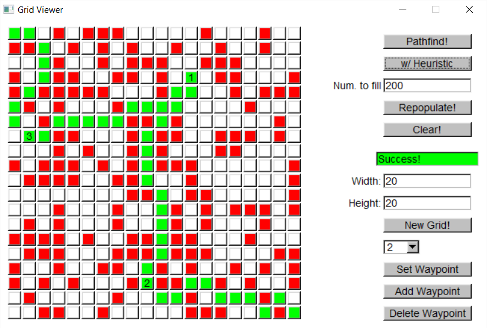

AStar Pathfinder
================

A simple A* implementation written in C++98, supporting features like
waypoints and variable grid sizes. The GUI is written in FLTK and
can be compiled using Quincy 2005. (Sorry about the old tooling)

An example of a grid with 3 waypoints travelled in heuristic order:

### To compile the command-line version:

`make`

### To compile the GUI version:

Open the .PRJ file in Quincy 2005 and compile/run

or

Compile all files except for main.cpp and link with FLTK

